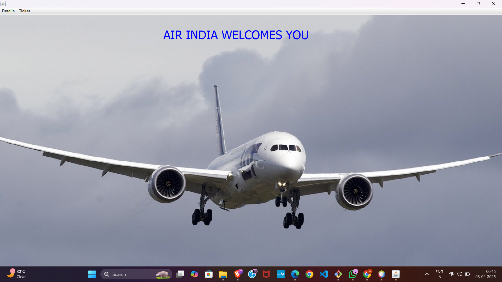
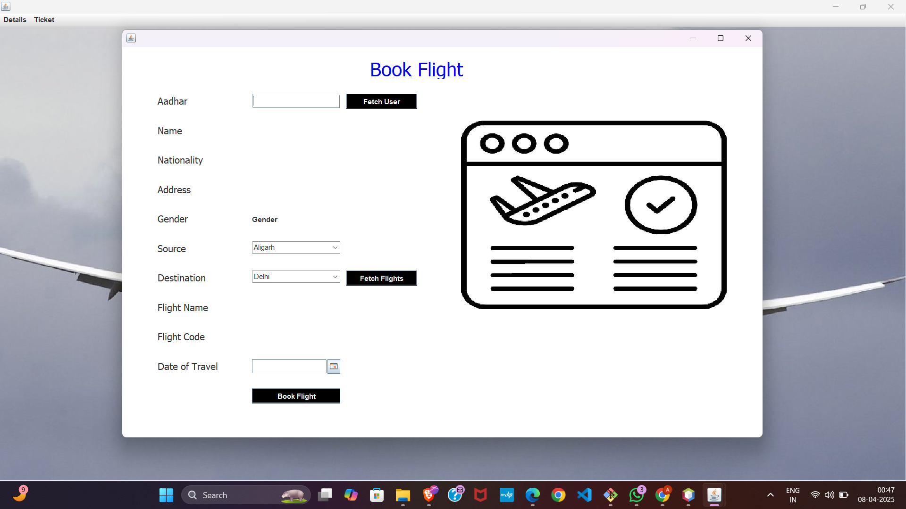
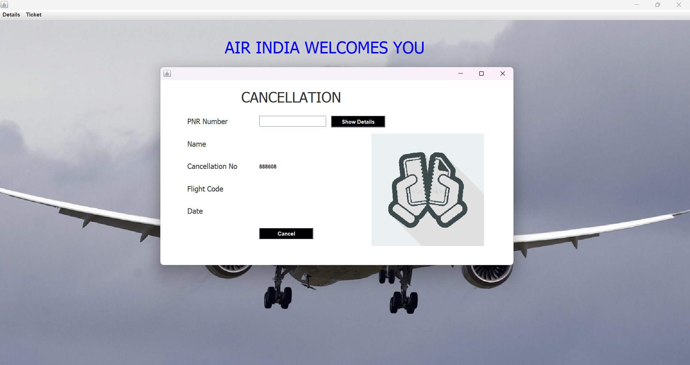

# ✈️ Airline Management System

A **Java-based Airline Management System** with a user-friendly GUI for managing flight bookings, customers, and boarding passes. Built using **Java Swing** and **MySQL**, this project showcases an end-to-end airline reservation workflow ideal for college projects or portfolio highlights.

---

## 🧩 Features

✅ Add and manage customer details  
✅ Book and cancel flights  
✅ Generate boarding passes  
✅ View and update flight schedules  
✅ Admin login system  
✅ Integrated with MySQL using JDBC  
✅ Sleek GUI built using Java Swing

---

## 🖥️ Screenshots

### 🔐 Home Interface

### 🎫 Booking Interface

### 📋 Cancel Ticket Page

---

## 🔧 Tech Stack

| Tech         | Description                          |
|--------------|--------------------------------------|
| Java         | Core programming language            |
| Java Swing   | GUI interface                        |
| MySQL        | Database backend                     |
| JDBC         | Java Database Connectivity (MySQL)   |
| NetBeans     | Recommended IDE (or use IntelliJ)    |

---

## 🗂️ Project Structure

airlinemanagementsystem/
├── AddCustomer.java
├── BookFlight.java
├── Cancel.java
├── BoardingPass.java
├── Conn.java
├── FlightInfo.java
├── Home.java
├── Login.java
├── icons/
└── ...

---

## 🚀 Getting Started

1. **Clone or download** this repository.
2. **Set up your MySQL database**:
   - Create a database and required tables (based on code in `Conn.java`).
3. **Configure `Conn.java`** with your database credentials.
4. **Run the application** via NetBeans, IntelliJ, or command line.
5. Explore airline operations in an interactive GUI!

---

## 📌 Author

**Ayush Goyal**  
📎 [LinkedIn](https://www.linkedin.com/in/ayush-goyal-617893281/)  
🐙 [GitHub](https://github.com/ayu-creatr/airline-management-system)

---

## 📘 License

This project is for educational and demonstration purposes. Feel free to modify and enhance it for your own use.

---

⭐ If you found this project useful or interesting, don't forget to **star it** on GitHub!

